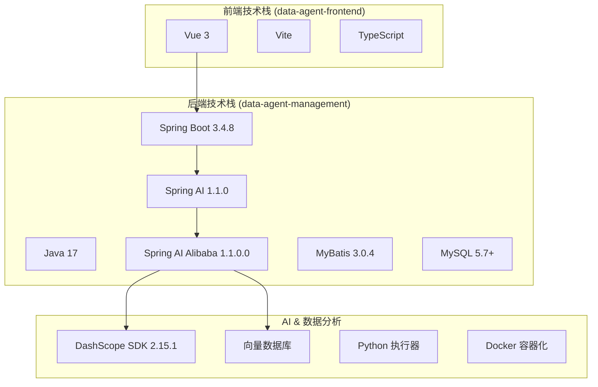

# DataAgent 系统开发白皮书

> **文档版本**: v1.0  
> **项目版本**: 1.0.0-SNAPSHOT  
> **最后更新**: 2026-01-20  
> **文档目的**: 帮助新人快速 Onboarding，厘清业务逻辑、数据流向、目录结构，并明确二次开发的切入点和风险点。

---

## 📋 文档索引

| 编号 | 文档名称 | 说明 | 状态 |
|------|----------|------|------|
| 00 | [本索引](./00-index.md) | 《系统开发白皮书》总索引与项目概览 | ✅ |
| 01 | [技术栈与目录结构](./01-tech-stack/README.md) | 核心技术栈、项目目录树详解、各包职责说明 | ⏳ |
| 02 | [数据模型与领域设计](./02-data-model/README.md) | ER 图、核心领域概念、数据生命周期 | ✅ |
| 03 | [核心业务模块详解](./03-core-modules/README.md) | 控制器、服务层、工作流引擎深度解析 | 🚧 |
| 04 | [StateGraph 工作流引擎](./04-workflow-engine/README.md) | 节点定义、调度机制、数据流转图 | ⏳ |
| 05 | [外部集成与连接器](./05-connectors/README.md) | 数据源连接器、MCP 协议、向量数据库 | ⏳ |
| 06 | [前端架构](./06-frontend/README.md) | Vue 3 组件体系、路由、状态管理 | ⏳ |
| 07 | [二次开发指南](./07-extension-guide/README.md) | 扩展点、配置详解、常见坑点 | ⏳ |
| 08 | [部署与运维](./08-deployment/README.md) | Docker 部署、环境配置、日志监控 | ⏳ |

---

## 🏗️ 项目概览

### 项目定位

**DataAgent** 是一个基于 **Spring AI Alibaba Graph** 打造的企业级智能数据分析 Agent。它超越了传统的 Text-to-SQL 工具，进化为一个能够执行 **Python 深度分析**、生成 **多维度图表报告** 的 AI 智能数据分析师。

### 核心技术栈



### 核心能力矩阵

| 能力域 | 核心特性 | 实现模块 |
|--------|----------|----------|
| **Text-to-SQL** | 自然语言转 SQL，多表复杂查询 | `SqlGenerateNode`, `SqlExecuteNode` |
| **意图识别** | 多轮对话理解，上下文推理 | `IntentRecognitionNode` |
| **Schema 召回** | RAG 增强的表结构检索 | `SchemaRecallNode`, `EvidenceRecallNode` |
| **Python 分析** | 自动生成并执行 Python 代码 | `PythonGenerateNode`, `PythonExecuteNode` |
| **报告生成** | ECharts 图表 + HTML/Markdown | `ReportGeneratorNode` |
| **人工反馈** | Human-in-the-loop 干预机制 | `HumanFeedbackNode` |
| **MCP 协议** | 模型上下文协议服务器 | `mcp` 服务模块 |

---

## 📁 顶层目录结构

```
DataAgent/
├── 📂 data-agent-management/     # 🔧 后端核心模块 (Spring Boot)
│   ├── pom.xml                   # Maven 配置
│   └── src/main/
│       ├── java/.../dataagent/   # Java 源码
│       └── resources/            # 配置文件与 Prompt 模板
│
├── 📂 data-agent-frontend/       # 🎨 前端模块 (Vue 3 + Vite)
│   ├── package.json              # NPM 配置
│   ├── vite.config.js            # Vite 构建配置
│   └── src/                      # Vue 组件与路由
│
├── 📂 docs/                      # 📚 官方文档
│   ├── ARCHITECTURE.md           # 架构设计文档
│   ├── DEVELOPER_GUIDE.md        # 开发者指南
│   ├── QUICK_START.md            # 快速开始
│   └── ADVANCED_FEATURES.md      # 高级功能
│
├── 📂 docker-file/               # 🐳 Docker 部署配置
├── 📂 CI/                        # 🔄 持续集成配置 (CheckStyle)
├── 📂 .github/                   # 🔀 GitHub Actions 工作流
│
├── pom.xml                       # 父 Maven POM
├── README.md                     # 项目介绍
└── LICENSE                       # Apache 2.0 许可证
```

---

## 🧩 后端包结构概览

```
com.alibaba.cloud.ai.dataagent/
├── 📦 controller/        # REST API 控制器层 (14个)
├── 📦 service/           # 业务服务层 (17个子模块, 77个类)
│   ├── agent/            # 智能体管理
│   ├── chat/             # 对话服务
│   ├── datasource/       # 数据源管理
│   ├── knowledge/        # 知识库服务
│   ├── llm/              # LLM 调用服务
│   ├── nl2sql/           # 自然语言到 SQL
│   ├── code/             # 代码执行服务
│   ├── vectorstore/      # 向量存储
│   └── ...               # 更多服务模块
│
├── 📦 workflow/          # StateGraph 工作流引擎
│   ├── node/             # 工作流节点 (16个)
│   └── dispatcher/       # 调度分发器 (11个)
│
├── 📦 connector/         # 外部连接器
│   ├── impls/            # 数据库连接器实现 (15种)
│   ├── pool/             # 连接池管理
│   └── ddl/              # DDL 解析
│
├── 📦 entity/            # 数据库实体 (12个)
├── 📦 dto/               # 数据传输对象 (30个)
├── 📦 vo/                # 视图对象 (13个)
├── 📦 mapper/            # MyBatis Mapper (13个)
├── 📦 config/            # Spring 配置类
├── 📦 enums/             # 枚举定义 (10个)
├── 📦 util/              # 工具类 (18个)
├── 📦 prompt/            # Prompt 模板处理
├── 📦 annotation/        # 自定义注解
├── 📦 aop/               # 切面处理
├── 📦 event/             # 事件处理
├── 📦 splitter/          # 文本分割器
├── 📦 strategy/          # 策略模式实现
├── 📦 bo/                # 业务对象
├── 📦 properties/        # 配置属性类
└── 📦 constant/          # 常量定义
```

---

## 🔄 StateGraph 工作流节点

系统采用 **Spring AI Alibaba Graph** 构建有向无环图 (DAG) 工作流，核心节点如下：

```mermaid
graph LR
    subgraph "意图理解阶段"
        A[IntentRecognitionNode<br/>意图识别]
        B[QueryEnhanceNode<br/>查询增强]
    end
    
    subgraph "Schema 检索阶段"
        C[SchemaRecallNode<br/>表结构召回]
        D[EvidenceRecallNode<br/>证据召回]
        E[TableRelationNode<br/>表关系推理]
    end
    
    subgraph "SQL 生成执行阶段"
        F[SqlGenerateNode<br/>SQL 生成]
        G[SqlExecuteNode<br/>SQL 执行]
        H[SemanticConsistencyNode<br/>语义一致性校验]
    end
    
    subgraph "计划与评估阶段"
        I[FeasibilityAssessmentNode<br/>可行性评估]
        J[PlannerNode<br/>计划生成]
        K[PlanExecutorNode<br/>计划执行]
        L[HumanFeedbackNode<br/>人工反馈]
    end
    
    subgraph "Python 分析阶段"
        M[PythonGenerateNode<br/>Python 代码生成]
        N[PythonExecuteNode<br/>Python 执行]
        O[PythonAnalyzeNode<br/>结果分析]
    end
    
    subgraph "报告生成阶段"
        P[ReportGeneratorNode<br/>报告生成]
    end
    
    A --> B --> C --> D --> E --> F --> G --> H
    H --> I --> J --> L --> K
    K --> M --> N --> O --> P
```



---

## 📊 核心实体关系预览

| 实体名称 | 职责说明 | 关联关系 |
|----------|----------|----------|
| `Agent` | 智能体定义 | 1:N → AgentDatasource, AgentKnowledge |
| `Datasource` | 数据源配置 | N:N ← Agent (via AgentDatasource) |
| `SemanticModel` | 语义模型 | 属于 Datasource |
| `BusinessKnowledge` | 业务知识库 | 用于 RAG 检索 |
| `ChatSession` | 对话会话 | 1:N → ChatMessage |
| `ChatMessage` | 对话消息 | 属于 ChatSession |
| `ModelConfig` | LLM 模型配置 | 全局配置 |
| `UserPromptConfig` | Prompt 模板 | 用户自定义 |

---

## 🚀 下一步

请告诉我你希望**优先深入了解哪个模块**：

1. **Phase 2: 数据底座与领域模型** - 详细分析 ER 图、核心实体、数据流向
2. **Phase 3: 核心业务链路** - 从某个具体功能入手（如 Text-to-SQL 流程、Python 分析流程）
3. **Phase 4: 二次开发指南** - 扩展点、配置详解、常见坑点

或者你可以直接指定某个具体模块/控制器/服务类，我将为你进行深度解析。
