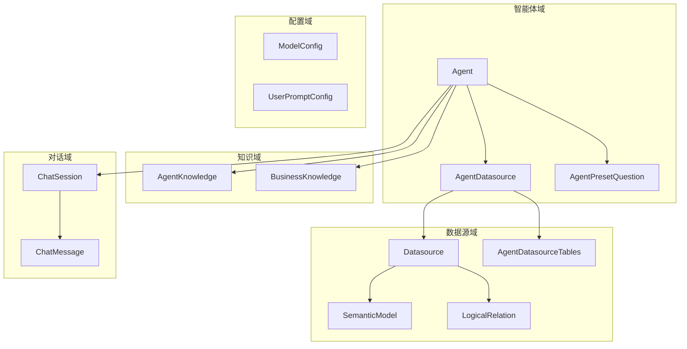

# 02.1 - 领域模型详解

> **模块状态**: ✅ 已完成  
> **上级目录**: [← 返回数据模型总览](./README.md)

---

## 🎯 领域边界与职责划分

本系统的数据模型围绕“智能体驱动的数据分析”展开，实体可被归入 5 个核心领域边界。这样划分的目的，是让数据与行为在边界内高度内聚，降低跨域耦合，便于扩展和演进。

---

## 🧠 核心领域概念（聚焦业务语义）

### 1) Agent（智能体）

**为什么存在**：这是系统的“业务入口”，一切配置、知识、数据源、对话都围绕 `Agent` 组织。通过把能力封装进智能体，可以同时服务多个业务场景而不会互相污染。

**业务含义**：一个 `Agent` 代表一个“会理解业务语义并能回答问题”的数据分析助手。

**关键字段解释**：
- `status` 决定是否对外可用，是产品发布流程的强约束。
- `api_key` 使 `Agent` 能作为服务对外暴露，用于集成系统间调用。
- `human_review_enabled` 是“人工复核”开关，避免关键业务误答。

**二次开发指南**：
- 新增“智能体类型”时优先通过扩展 `status` 或新增 `category` 进行软隔离。
- 需要区别不同团队或租户时，应在 `admin_id` 上做业务隔离。

---

### 2) Datasource（数据源）

**为什么存在**：智能体必须“知道去哪里查数据”。数据源统一抽象，让上层业务不用关心具体数据库类型。

**业务含义**：一条 `Datasource` 就是一份数据连接配置，决定了检索范围与 SQL 方言。

**关键字段解释**：
- `type` 决定连接器选择（MySQL/PostgreSQL/DM 等）。
- `test_status` 负责健康检测，是稳定性保障的关键点。

**二次开发指南**：
- 新增数据库类型时，必须同步扩展连接器实现、方言枚举与前端配置项。

---

### 3) SemanticModel（语义模型）

**为什么存在**：LLM 很难直接理解物理字段名，必须做“语义映射”。

**业务含义**：这是 NL2SQL 的“翻译词典”，把技术字段翻译成业务术语。

**关键字段解释**：
- `column_name` 是物理字段，不变更；`business_name` 是语义别名，可调优。
- `synonyms` 是检索扩展的核心，决定召回率。

**二次开发指南**：
- 若引入更复杂的语义召回策略（例如 embedding + rerank），可以在此实体补充向量或权重字段。

---

### 4) LogicalRelation（逻辑外键）

**为什么存在**：真实数据库并不总有物理外键，LLM 也无法推断表关联。

**业务含义**：人为定义的“逻辑外键”，辅助 LLM 做 JOIN 规划。

**关键字段解释**：
- `relation_type` 帮助推断基数，影响 SQL JOIN 方式。
- `description` 用于 Prompt 强化，提升解释性。

**二次开发指南**：
- 新增多表检索场景时，应优先维护 `LogicalRelation`，而不是在 Prompt 中硬编码。

---

### 5) AgentKnowledge / BusinessKnowledge（知识域）

**为什么存在**：系统不只回答“结构化数据”，也需要回答“业务规则与背景”。

**业务含义**：
- `BusinessKnowledge` 是跨智能体的“通用词库”。
- `AgentKnowledge` 是智能体级的私有知识库。

**关键字段解释**：
- `embeddingStatus` 表示向量化生命周期，是召回是否可用的核心状态机。

**二次开发指南**：
- 做多租户时要保证向量索引按 `agent_id` 分区。
- 文档大批量上传时需要关注异步任务队列与失败重试机制。

---

### 6) ChatSession / ChatMessage（对话域）

**为什么存在**：需要对话上下文以支持多轮理解与追溯。

**业务含义**：
- `ChatSession` 是一次对话的容器。
- `ChatMessage` 是消息记录，包含角色与结构化元数据。

**二次开发指南**：
- 若要做“会话归档/检索”，应优先扩展 `ChatSession.status` 与索引设计。

---

### 7) ModelConfig / UserPromptConfig（配置域）

**为什么存在**：模型供应商与 Prompt 需要可配置，而非硬编码。

**二次开发指南**：
- 扩展模型供应商时，必须保证 `model_type` 与调用路径匹配。
