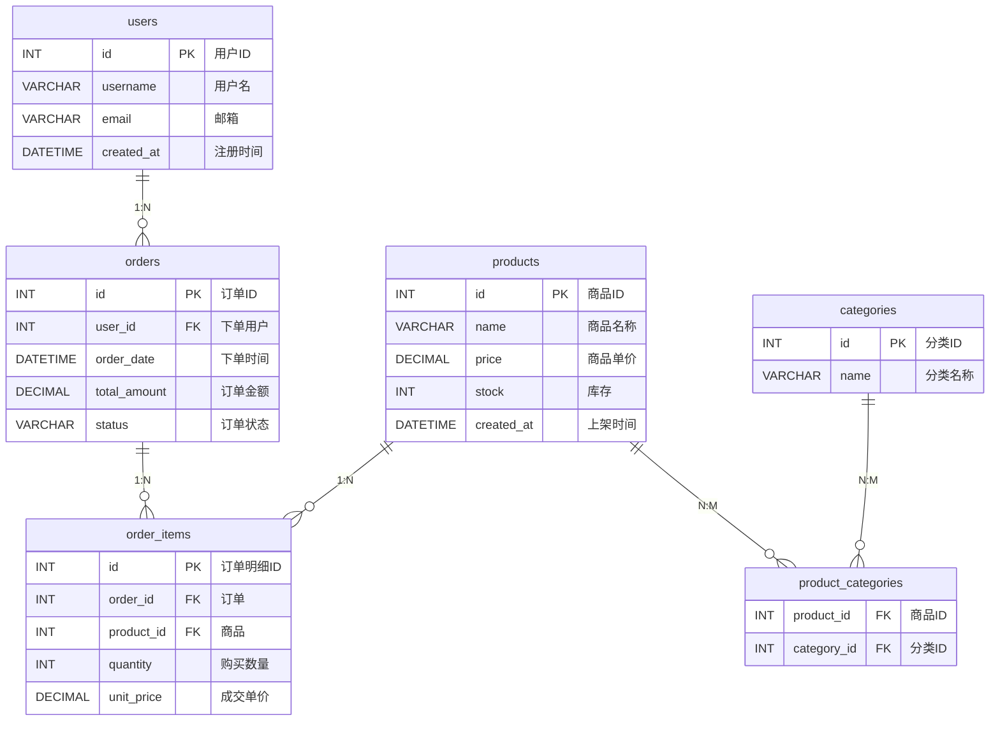
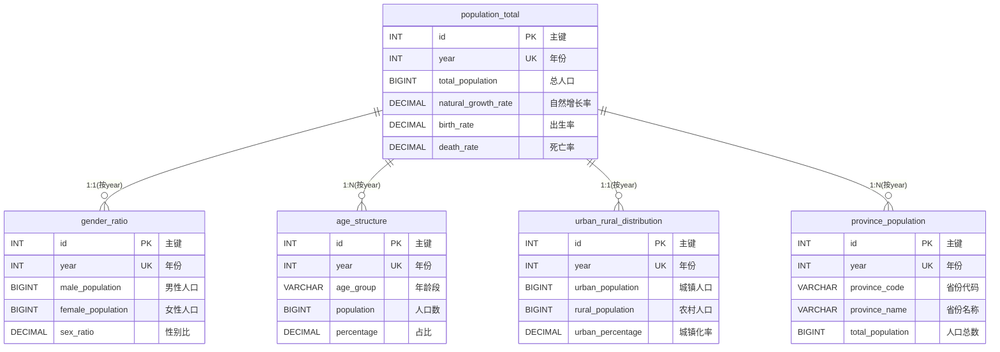

# 02.2 - 示例数据库与 ER 图

> **模块状态**: ✅ 已完成  
> **上级目录**: [← 返回数据模型总览](./README.md)

---

本项目提供了两套示例数据源，用于演示智能体的建模、查询与分析能力：

1. **产品交易库（MySQL）**：`docker-file/config/mysql/product_db.sql`
2. **人口统计库（PostgreSQL）**：`docker-file/config/postgres/china_population_db.sql`

它们体现了两类典型业务：**交易型数据** 与 **统计型数据**，便于验证 NL2SQL 与数据分析能力。

---

## 🛒 产品交易库（product_db）ER 图

### 业务语义解析

- 这是典型的电商交易模型，`orders` 是事实表，`order_items` 是明细表。
- `product_categories` 把商品与分类解耦，支持多对多，适合检索“某类商品的销售情况”。

**二次开发指南**：
- 若新增促销或优惠券，建议引入独立的 `promotion` 与 `order_discount` 表，避免污染订单主表结构。

---

## 📈 人口统计库（china_population_db）ER 图

### 业务语义解析

- 这是典型的**统计维度型模型**，`year` 是事实粒度。
- 该模型适合做趋势分析和多维钻取，例如“某年城镇化率与性别比的相关性”。

**二次开发指南**：
- 如需增加更细粒度（季度、月度），应引入 `time_dim` 维度表，避免仅用 `year` 造成扩展困难。
