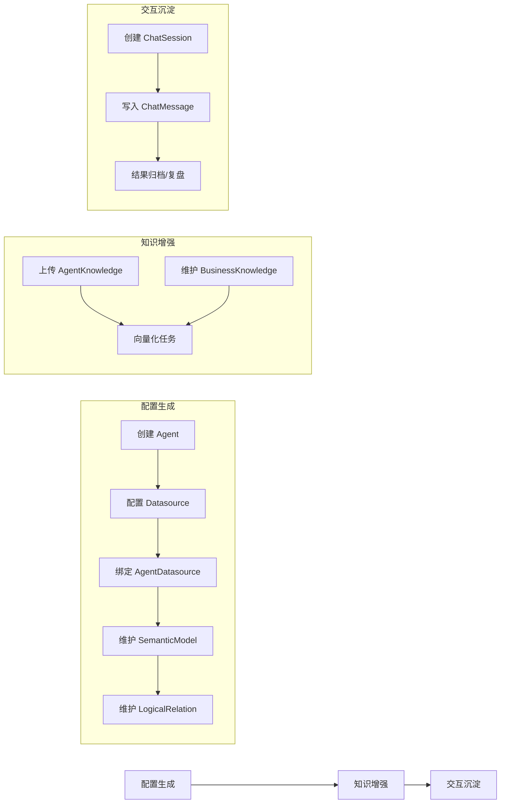
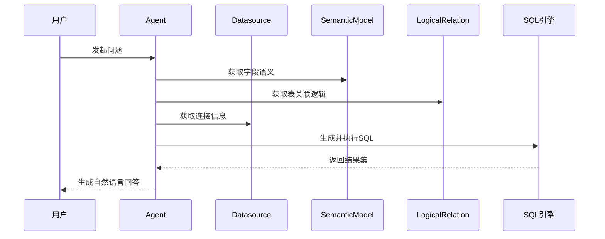
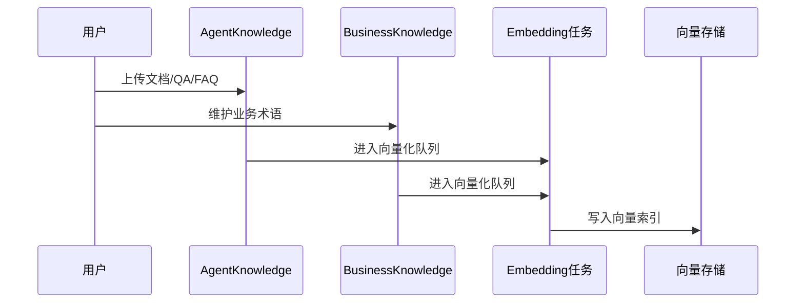
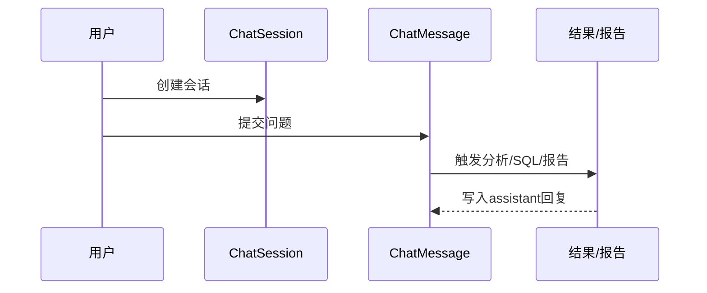

# 02.3 - 数据生命周期与流向

> **模块状态**: ✅ 已完成  
> **上级目录**: [← 返回数据模型总览](./README.md)

---

## 🔄 数据生命周期全景

系统中的数据大体经历三个阶段：**配置生成 → 知识增强 → 交互沉淀**。

---

## 🧭 关键数据流向说明

### 1) 结构化数据流向（以 SQL 为核心）

**业务意义**：
- `SemanticModel` 与 `LogicalRelation` 是 SQL 生成质量的关键变量，缺失会导致 SQL 结构错误或召回不足。

**二次开发指南**：
- 若引入新的 SQL 生成策略，应在生成前统一聚合语义模型与逻辑关系，避免业务逻辑分散在多个节点中。

---

### 2) 知识增强流向（以向量化为核心）

**业务意义**：
- `embeddingStatus` 是知识可用性的“状态机”，是前端轮询与后端重试的依据。

**二次开发指南**：
- 若接入新的向量数据库，需保证向量写入与业务表状态更新的事务一致性。

---

### 3) 对话沉淀流向（以会话为核心）

**业务意义**：
- `ChatMessage` 既是对话记录，也是调试与回溯的审计依据。

**二次开发指南**：
- 若要支持“对话回放”，必须保持 `ChatMessage` 的顺序与角色一致性。
