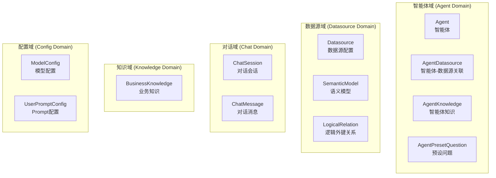
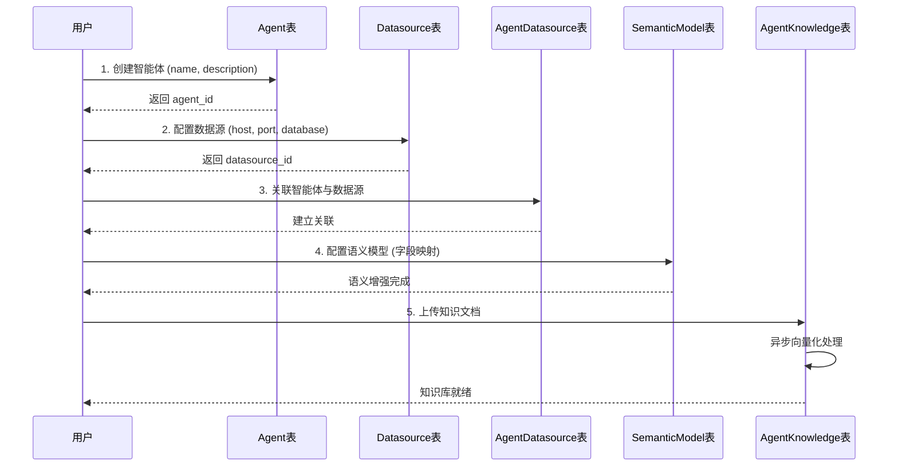
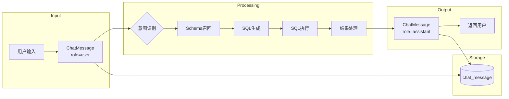

# 02 - 数据模型与领域设计

> **模块状态**: ✅ 已完成  
> **上级目录**: [← 返回索引](../00-index.md)

---

## 🗄️ 核心实体概览

本系统包含 **12 个核心数据实体**，按业务域分为以下几类：



---

## 📊 核心 ER 图

```mermaid
erDiagram
    %% ==================== 智能体核心 ====================
    agent {
        INT id PK "主键ID"
        VARCHAR name "智能体名称"
        TEXT description "描述"
        TEXT avatar "头像URL"
        VARCHAR status "状态: draft/published/offline"
        VARCHAR api_key "API Key (sk-xxx)"
        TINYINT api_key_enabled "API Key启用: 0/1"
        TEXT prompt "自定义Prompt"
        VARCHAR category "分类"
        BIGINT admin_id "管理员ID"
        TEXT tags "标签(逗号分隔)"
        TINYINT human_review_enabled "人工复核: 0/1"
        TIMESTAMP create_time "创建时间"
        TIMESTAMP update_time "更新时间"
    }
    
    %% ==================== 数据源 ====================
    datasource {
        INT id PK "主键ID"
        VARCHAR name "数据源名称"
        VARCHAR type "类型: mysql/postgresql等"
        VARCHAR host "主机地址"
        INT port "端口号"
        VARCHAR database_name "数据库名"
        VARCHAR username "用户名"
        VARCHAR password "密码(加密)"
        VARCHAR connection_url "完整连接URL"
        VARCHAR status "状态: active/inactive"
        VARCHAR test_status "测试状态: success/failed/unknown"
        TEXT description "描述"
        BIGINT creator_id "创建者ID"
    }
    
    %% ==================== 智能体-数据源关联 ====================
    agent_datasource {
        INT id PK "主键ID"
        INT agent_id FK "智能体ID"
        INT datasource_id FK "数据源ID"
        TINYINT is_active "是否启用: 0/1"
    }
    
    agent_datasource_tables {
        INT id PK "主键ID"
        INT agent_datasource_id FK "智能体数据源ID"
        VARCHAR table_name "选中的表名"
    }
    
    %% ==================== 语义模型 ====================
    semantic_model {
        INT id PK "主键ID"
        INT agent_id FK "智能体ID"
        INT datasource_id FK "数据源ID"
        VARCHAR table_name "表名"
        VARCHAR column_name "物理字段名"
        VARCHAR business_name "业务名/别名"
        TEXT synonyms "同义词"
        TEXT business_description "业务描述"
        VARCHAR column_comment "字段原始注释"
        VARCHAR data_type "数据类型"
        TINYINT status "状态: 0停用/1启用"
    }
    
    %% ==================== 逻辑外键 ====================
    logical_relation {
        INT id PK "主键ID"
        INT datasource_id FK "数据源ID"
        VARCHAR source_table_name "主表名"
        VARCHAR source_column_name "主表字段"
        VARCHAR target_table_name "关联表名"
        VARCHAR target_column_name "关联表字段"
        VARCHAR relation_type "关系类型: 1:1/1:N/N:1"
        VARCHAR description "业务描述"
        TINYINT is_deleted "逻辑删除: 0/1"
    }
    
    %% ==================== 智能体知识 ====================
    agent_knowledge {
        INT id PK "主键ID"
        INT agent_id FK "智能体ID"
        VARCHAR title "知识标题"
        VARCHAR type "类型: DOCUMENT/QA/FAQ"
        TEXT question "问题(QA/FAQ)"
        MEDIUMTEXT content "内容"
        INT is_recall "召回状态: 0/1"
        VARCHAR embedding_status "向量化状态"
        VARCHAR error_msg "错误信息"
        VARCHAR source_filename "原始文件名"
        VARCHAR file_path "文件路径"
        BIGINT file_size "文件大小"
        VARCHAR file_type "文件类型"
        VARCHAR splitter_type "分块策略"
        INT is_deleted "逻辑删除: 0/1"
        INT is_resource_cleaned "资源清理: 0/1"
    }
    
    %% ==================== 业务知识 ====================
    business_knowledge {
        INT id PK "主键ID"
        VARCHAR business_term "业务名词"
        TEXT description "描述"
        TEXT synonyms "同义词"
        INT is_recall "是否召回: 0/1"
        INT agent_id FK "智能体ID"
        VARCHAR embedding_status "向量化状态"
        VARCHAR error_msg "错误信息"
        INT is_deleted "逻辑删除: 0/1"
    }
    
    %% ==================== 预设问题 ====================
    agent_preset_question {
        INT id PK "主键ID"
        INT agent_id FK "智能体ID"
        TEXT question "预设问题"
        INT sort_order "排序"
        TINYINT is_active "启用: 0/1"
    }
    
    %% ==================== 对话会话 ====================
    chat_session {
        VARCHAR id PK "会话ID(UUID)"
        INT agent_id FK "智能体ID"
        VARCHAR title "会话标题"
        VARCHAR status "状态: active/archived/deleted"
        TINYINT is_pinned "置顶: 0/1"
        BIGINT user_id "用户ID"
    }
    
    %% ==================== 对话消息 ====================
    chat_message {
        BIGINT id PK "消息ID"
        VARCHAR session_id FK "会话ID"
        VARCHAR role "角色: user/assistant/system"
        TEXT content "消息内容"
        VARCHAR message_type "消息类型: text/sql/result/error"
        JSON metadata "元数据(JSON)"
    }
    
    %% ==================== 模型配置 ====================
    model_config {
        INT id PK "主键ID"
        VARCHAR provider "厂商标识"
        VARCHAR base_url "Base URL"
        VARCHAR api_key "API密钥"
        VARCHAR model_name "模型名称"
        DECIMAL temperature "温度参数"
        TINYINT is_active "是否激活"
        INT max_tokens "最大令牌数"
        VARCHAR model_type "模型类型: CHAT/EMBEDDING"
        VARCHAR completions_path "Chat路径"
        VARCHAR embeddings_path "Embedding路径"
        INT is_deleted "逻辑删除: 0/1"
    }
    
    %% ==================== Prompt配置 ====================
    user_prompt_config {
        VARCHAR id PK "配置ID(UUID)"
        VARCHAR name "配置名称"
        VARCHAR prompt_type "Prompt类型"
        INT agent_id FK "智能体ID(可空)"
        TEXT system_prompt "系统Prompt"
        TINYINT enabled "是否启用"
        TEXT description "描述"
        INT priority "优先级"
        INT display_order "显示顺序"
        VARCHAR creator "创建者"
    }
    
    %% ==================== 关系定义 ====================
    agent ||--o{ agent_datasource : "1:N 拥有"
    agent ||--o{ agent_knowledge : "1:N 拥有"
    agent ||--o{ agent_preset_question : "1:N 拥有"
    agent ||--o{ business_knowledge : "1:N 拥有"
    agent ||--o{ chat_session : "1:N 拥有"
    agent ||--o{ semantic_model : "1:N 拥有"
    agent ||--o{ user_prompt_config : "1:N 可选配置"
    
    datasource ||--o{ agent_datasource : "N:1 被关联"
    datasource ||--o{ semantic_model : "1:N 拥有"
    datasource ||--o{ logical_relation : "1:N 拥有"
    
    agent_datasource ||--o{ agent_datasource_tables : "1:N 选中表"
    
    chat_session ||--o{ chat_message : "1:N 包含"
```



---

## 🔑 核心领域概念解读

### 1. Agent（智能体）

**业务含义**: 智能体是系统的核心实体，代表一个可独立工作的 AI 数据分析助手。

| 关键属性 | 业务解释 |
|----------|----------|
| `status` | 生命周期状态：`draft`(草稿) → `published`(已发布，可对外服务) → `offline`(下线) |
| `api_key` | 对外 API 访问凭证，格式 `sk-xxx`，用于外部系统集成 |
| `human_review_enabled` | 是否启用 Human-in-the-loop 机制，开启后计划生成阶段需人工确认 |
| `prompt` | 自定义系统 Prompt，用于个性化调整智能体行为 |

**核心关系**:
- 1:N → `AgentDatasource`: 一个智能体可关联多个数据源
- 1:N → `AgentKnowledge`: 一个智能体可拥有多份知识库文档
- 1:N → `ChatSession`: 一个智能体可有多个对话会话

---

### 2. Datasource（数据源）

**业务含义**: 数据源是智能体分析数据的来源，支持 MySQL、PostgreSQL、DM（达梦）、Elasticsearch 等多种类型。

| 关键属性 | 业务解释 |
|----------|----------|
| `type` | 数据库类型，决定使用哪个连接器实现（`connector/impls/`） |
| `test_status` | 连接测试结果，`success`/`failed`/`unknown`，用于健康检查 |
| `password` | 加密存储的密码 |

**核心关系**:
- 1:N → `SemanticModel`: 描述该数据源中字段的业务语义
- 1:N → `LogicalRelation`: 描述该数据源中表之间的逻辑外键关系

---

### 3. SemanticModel（语义模型）

**业务含义**: 语义模型是 **NL2SQL 精度提升的关键**，它将数据库物理字段名映射为业务术语。

| 关键属性 | 业务解释 |
|----------|----------|
| `column_name` | 物理字段名，如 `csat_score` |
| `business_name` | 业务别名，如 `客户满意度分数` |
| `synonyms` | 同义词列表，如 `满意度,客户评分` |
| `business_description` | 详细业务描述，用于 Prompt 注入 |

**关键方法**:
```java
public String getPromptInfo() {
    return String.format("业务名称: %s, 表名: %s, 数据库字段名: %s, 字段同义词: %s, 业务描述: %s, 数据类型: %s",
        businessName, tableName, columnName, synonyms, businessDescription, dataType);
}
```

---

### 4. ChatSession & ChatMessage（对话域）

**业务含义**: 对话域记录用户与智能体的交互历史。

| ChatSession 属性 | 业务解释 |
|------------------|----------|
| `id` | UUID 格式，全局唯一 |
| `is_pinned` | 是否置顶该会话 |
| `status` | `active`(活跃) / `archived`(归档) / `deleted`(已删除) |

| ChatMessage 属性 | 业务解释 |
|------------------|----------|
| `role` | `user`(用户) / `assistant`(AI助手) / `system`(系统提示) |
| `message_type` | `text`(文本) / `sql`(SQL查询) / `result`(查询结果) / `error`(错误) |
| `metadata` | JSON 格式元数据，可存储 SQL 执行时间、结果行数等 |

---

### 5. BusinessKnowledge & AgentKnowledge（知识域）

**业务含义**: 知识域用于 RAG 检索增强，提升查询理解和 SQL 生成准确率。

| 类型 | 说明 |
|------|------|
| `BusinessKnowledge` | 业务术语库，存储业务名词、描述、同义词 |
| `AgentKnowledge` | 智能体专属知识，支持三种类型：`DOCUMENT`(文档), `QA`(问答), `FAQ`(常见问题) |

**向量化状态流转**:
```
PENDING(待处理) → PROCESSING(处理中) → COMPLETED(已完成)
                                   ↘ FAILED(失败)
```

---

## 🔄 数据生命周期与流向

### 智能体创建流程



### 对话数据流向



---

## 🧩 二次开发指南

### 新增实体检查清单

如需新增业务实体，请确保完成以下步骤：

1. **Entity 类**: `entity/` 目录下创建实体类，使用 Lombok 注解
2. **Mapper 接口**: `mapper/` 目录下创建 MyBatis Mapper
3. **SQL Schema**: `resources/sql/schema.sql` 中添加建表语句
4. **DTO/VO**: 根据需要创建数据传输对象
5. **外键关系**: 如有关联，需更新 `logical_relation` 表或代码中的关系定义

### 常见陷阱

> [!CAUTION]
> **逻辑删除字段**: 多数表使用 `is_deleted` 进行逻辑删除，查询时需注意过滤条件

> [!WARNING]
> **时间字段格式**: 部分实体使用 `createdTime`，部分使用 `createTime`，需注意对应 SQL 字段的下划线命名

> [!TIP]
> **向量化异步处理**: `AgentKnowledge` 和 `BusinessKnowledge` 的向量化是异步的，前端需轮询 `embeddingStatus` 状态
