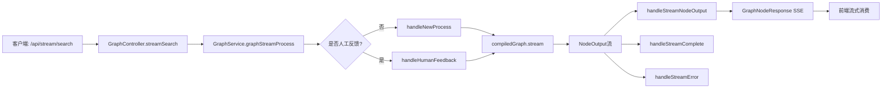
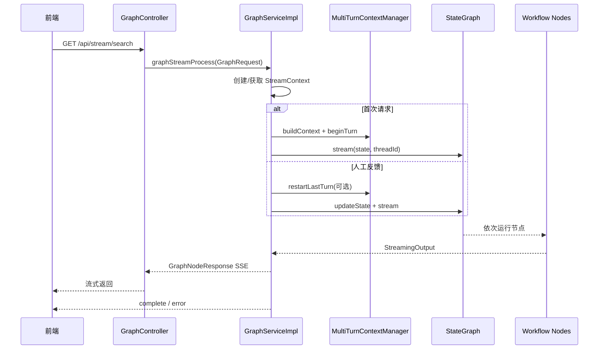

# 03.1 - 核心调用链路（流式搜索）

> **模块状态**: ✅ 已完成  
> **上级目录**: [← 返回核心模块总览](./README.md)

---

## ✅ 功能概述

本链路负责把用户自然语言请求转化为“可执行的分析流程”，并通过 **SSE 流式输出**逐步返回结果。

---

## 🔗 调用入口与边界

**入口**：GraphController 的流式搜索接口。  
**路径**：[data-agent-management/src/main/java/com/alibaba/cloud/ai/dataagent/controller/GraphController.java](data-agent-management/src/main/java/com/alibaba/cloud/ai/dataagent/controller/GraphController.java)

该接口的核心职责：
- 构建 GraphRequest（包含 Agent、线程、Query、人工反馈状态）。
- 以 SSE 形式向前端持续推送节点输出。

---

## 🧭 整体调用流程（从开始到结束）

---

## ⏱️ 端到端时序图

---

## 🧩 核心节点链路解析（按流程顺序）

节点定义来源：StateGraph 配置。  
路径：[data-agent-management/src/main/java/com/alibaba/cloud/ai/dataagent/config/DataAgentConfiguration.java](data-agent-management/src/main/java/com/alibaba/cloud/ai/dataagent/config/DataAgentConfiguration.java)

### 1) IntentRecognitionNode
**目的**：判断用户意图（是否需要 SQL、是否需要分析/报告）。

### 2) EvidenceRecallNode → QueryEnhanceNode
**目的**：补充证据与语义信息，提升后续召回与 SQL 生成准确率。

### 3) SchemaRecallNode → TableRelationNode
**目的**：召回表结构与逻辑关系，减少“字段/表缺失”。

### 4) FeasibilityAssessmentNode
**目的**：判断可执行性，避免生成不可落地的计划。

### 5) PlannerNode → PlanExecutorNode
**目的**：生成计划并验证可执行性（分步执行/修复）。

### 6) SQLGenerateNode → SemanticConsistencyNode → SQLExecuteNode
**目的**：生成 SQL、做语义一致性校验、执行并返回结果。

### 7) PythonGenerateNode → PythonExecuteNode → PythonAnalyzeNode
**目的**：当需要复杂分析时使用 Python 推导。

### 8) ReportGeneratorNode
**目的**：生成报告型输出（图表/报告文本）。

### 9) HumanFeedbackNode
**目的**：在关键步骤引入人工复核，允许回退与修复。

---

## 🔍 核心函数解构

### A. `GraphController.streamSearch()`

**输入/输出**：
- 输入：`agentId`, `query`, `threadId`（可选）、人工反馈参数
- 输出：SSE 流式响应 `GraphNodeResponse`

**黑盒逻辑**：
- 把 HTTP 请求转换为可执行的图请求，并持续推送节点输出。

**关键规则**：
- 断开连接时会触发 `stopStreamProcessing()` 停止处理。

---

### B. `GraphServiceImpl.graphStreamProcess()`

**输入/输出**：
- 输入：`GraphRequest`
- 输出：异步写入 SSE sink

**黑盒逻辑**：
- 统一处理新请求与人工反馈请求，确保会话上下文存在。

**关键规则**：
- 若无 `threadId` 会自动生成。
- `humanFeedbackContent` 非空时走恢复流程。

---

### C. `handleNewProcess()`

**输入/输出**：
- 输入：`agentId`, `query`, `threadId`
- 输出：Graph 流式节点输出

**黑盒逻辑**：
- 构建多轮上下文并开启一轮新的图执行。

**关键规则**：
- 参数缺失会抛出 `IllegalArgumentException`。
- `nl2sqlOnly` 会跳过后续分析链路。

---

### D. `handleHumanFeedback()`

**输入/输出**：
- 输入：反馈内容与拒绝标志
- 输出：在既有图状态基础上继续执行

**黑盒逻辑**：
- 将反馈注入图状态并从上次中断处恢复。

**关键规则**：
- 若 `rejectedPlan=true`，会回退到计划阶段。

---

### E. `handleStreamNodeOutput()`

**输入/输出**：
- 输入：`StreamingOutput`
- 输出：`GraphNodeResponse` SSE

**黑盒逻辑**：
- 对流式 chunk 进行分类与过滤，保证只输出有效内容。

**关键规则**：
- 文本类型标记符号不会返回给前端。
- `PlannerNode` 输出会写入多轮上下文。

---

## ⚠️ 异常处理机制

| 场景 | 处理方式 | 业务含义 |
|------|----------|----------|
| 参数缺失 | 抛出 `IllegalArgumentException` | 防止启动无效图执行 |
| 客户端断开 | `stopStreamProcessing()` | 避免资源泄漏 |
| 节点输出失败 | 停止流并清理上下文 | 释放线程与订阅 |
| 流式异常 | 发送 `STREAM_EVENT_ERROR` | 前端可感知失败 |
| 正常结束 | 发送 `STREAM_EVENT_COMPLETE` | 前端结束渲染 |

---

## 🧩 二次开发指南

1. **新增节点**：在 StateGraph 中注册节点与路由，并同步扩展 Dispatcher。
2. **新增输出类型**：需要扩展 `TextType` 识别规则并确保前端渲染适配。
3. **扩展人工复核**：通过 `HUMAN_FEEDBACK_NODE` 增加更多状态分支。
4. **优化性能**：对高耗时节点引入异步与缓存，减少主链路阻塞。
