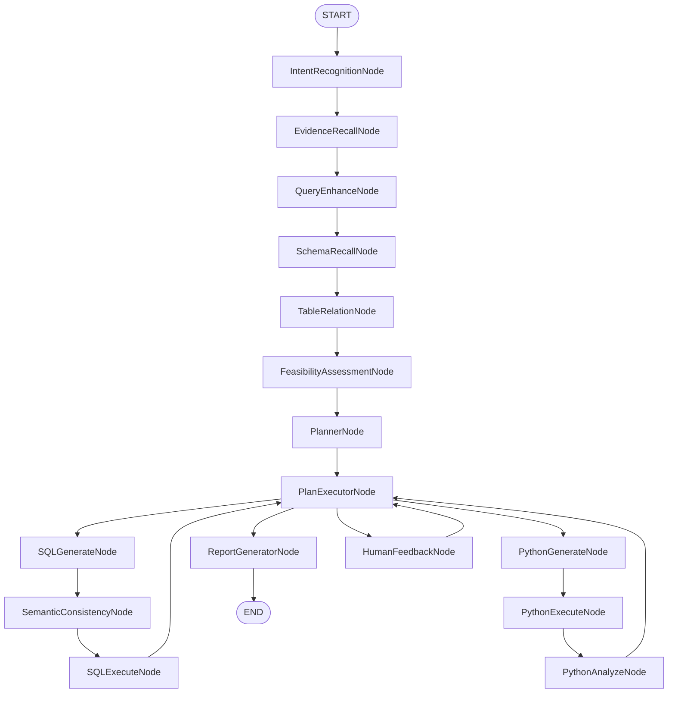

# 03.2 - Graph 工作流节点拆解

> **模块状态**: ✅ 已完成  
> **上级目录**: [← 返回核心模块总览](./README.md)

---

## 🧭 节点总览（从开始到结束）

---

## ✅ 节点清单与代码定位

- IntentRecognitionNode：[data-agent-management/src/main/java/com/alibaba/cloud/ai/dataagent/workflow/node/IntentRecognitionNode.java](data-agent-management/src/main/java/com/alibaba/cloud/ai/dataagent/workflow/node/IntentRecognitionNode.java)
- EvidenceRecallNode：[data-agent-management/src/main/java/com/alibaba/cloud/ai/dataagent/workflow/node/EvidenceRecallNode.java](data-agent-management/src/main/java/com/alibaba/cloud/ai/dataagent/workflow/node/EvidenceRecallNode.java)
- QueryEnhanceNode：[data-agent-management/src/main/java/com/alibaba/cloud/ai/dataagent/workflow/node/QueryEnhanceNode.java](data-agent-management/src/main/java/com/alibaba/cloud/ai/dataagent/workflow/node/QueryEnhanceNode.java)
- SchemaRecallNode：[data-agent-management/src/main/java/com/alibaba/cloud/ai/dataagent/workflow/node/SchemaRecallNode.java](data-agent-management/src/main/java/com/alibaba/cloud/ai/dataagent/workflow/node/SchemaRecallNode.java)
- TableRelationNode：[data-agent-management/src/main/java/com/alibaba/cloud/ai/dataagent/workflow/node/TableRelationNode.java](data-agent-management/src/main/java/com/alibaba/cloud/ai/dataagent/workflow/node/TableRelationNode.java)
- FeasibilityAssessmentNode：[data-agent-management/src/main/java/com/alibaba/cloud/ai/dataagent/workflow/node/FeasibilityAssessmentNode.java](data-agent-management/src/main/java/com/alibaba/cloud/ai/dataagent/workflow/node/FeasibilityAssessmentNode.java)
- PlannerNode：[data-agent-management/src/main/java/com/alibaba/cloud/ai/dataagent/workflow/node/PlannerNode.java](data-agent-management/src/main/java/com/alibaba/cloud/ai/dataagent/workflow/node/PlannerNode.java)
- PlanExecutorNode：[data-agent-management/src/main/java/com/alibaba/cloud/ai/dataagent/workflow/node/PlanExecutorNode.java](data-agent-management/src/main/java/com/alibaba/cloud/ai/dataagent/workflow/node/PlanExecutorNode.java)
- SQLGenerateNode：[data-agent-management/src/main/java/com/alibaba/cloud/ai/dataagent/workflow/node/SqlGenerateNode.java](data-agent-management/src/main/java/com/alibaba/cloud/ai/dataagent/workflow/node/SqlGenerateNode.java)
- SemanticConsistencyNode：[data-agent-management/src/main/java/com/alibaba/cloud/ai/dataagent/workflow/node/SemanticConsistencyNode.java](data-agent-management/src/main/java/com/alibaba/cloud/ai/dataagent/workflow/node/SemanticConsistencyNode.java)
- SQLExecuteNode：[data-agent-management/src/main/java/com/alibaba/cloud/ai/dataagent/workflow/node/SqlExecuteNode.java](data-agent-management/src/main/java/com/alibaba/cloud/ai/dataagent/workflow/node/SqlExecuteNode.java)
- PythonGenerateNode：[data-agent-management/src/main/java/com/alibaba/cloud/ai/dataagent/workflow/node/PythonGenerateNode.java](data-agent-management/src/main/java/com/alibaba/cloud/ai/dataagent/workflow/node/PythonGenerateNode.java)
- PythonExecuteNode：[data-agent-management/src/main/java/com/alibaba/cloud/ai/dataagent/workflow/node/PythonExecuteNode.java](data-agent-management/src/main/java/com/alibaba/cloud/ai/dataagent/workflow/node/PythonExecuteNode.java)
- PythonAnalyzeNode：[data-agent-management/src/main/java/com/alibaba/cloud/ai/dataagent/workflow/node/PythonAnalyzeNode.java](data-agent-management/src/main/java/com/alibaba/cloud/ai/dataagent/workflow/node/PythonAnalyzeNode.java)
- ReportGeneratorNode：[data-agent-management/src/main/java/com/alibaba/cloud/ai/dataagent/workflow/node/ReportGeneratorNode.java](data-agent-management/src/main/java/com/alibaba/cloud/ai/dataagent/workflow/node/ReportGeneratorNode.java)
- HumanFeedbackNode：[data-agent-management/src/main/java/com/alibaba/cloud/ai/dataagent/workflow/node/HumanFeedbackNode.java](data-agent-management/src/main/java/com/alibaba/cloud/ai/dataagent/workflow/node/HumanFeedbackNode.java)

---

## 🔍 节点逐一拆解（黑盒视角）

### 1) IntentRecognitionNode

**功能概述**：识别用户请求是闲聊还是数据分析，并输出结构化意图。

**输入/输出**：
- 输入：`INPUT_KEY`, `MULTI_TURN_CONTEXT`
- 输出：`INTENT_RECOGNITION_NODE_OUTPUT`

**黑盒逻辑**：
- 基于多轮上下文构建意图识别提示词，调用 LLM 输出 JSON 格式意图。

**关键规则**：
- 输出 JSON 由 `JsonParseUtil` 转换为 DTO，供 Dispatcher 决策。

**异常处理**：
- JSON 解析失败会导致后续分支判断失真，需要在 Dispatcher 容错。

**二次开发指南**：
- 增加新意图类型时，需同步扩展 DTO 与 Dispatcher 分流逻辑。

---

### 2) EvidenceRecallNode

**功能概述**：从知识库与向量索引中召回业务证据，增强后续语义理解。

**输入/输出**：
- 输入：`INPUT_KEY`, `AGENT_ID`, `MULTI_TURN_CONTEXT`
- 输出：`EVIDENCE`

**黑盒逻辑**：
- 先做“查询重写”，再向向量库检索业务术语与智能体知识。
- 证据内容以结构化文本拼接回写。

**关键规则**：
- 证据为空时返回“无”，避免影响下游提示词。

**异常处理**：
- 向量检索异常会返回空证据并结束流。

**二次开发指南**：
- 若引入新的检索源（如 FAQ 系统），应在此节点统一拼接证据。

---

### 3) QueryEnhanceNode

**功能概述**：把用户问题转换为更规范的“canonical query”。

**输入/输出**：
- 输入：`INPUT_KEY`, `EVIDENCE`, `MULTI_TURN_CONTEXT`
- 输出：`QUERY_ENHANCE_NODE_OUTPUT`

**黑盒逻辑**：
- LLM 生成结构化 JSON，抽取业务核心问题和关键词。

**关键规则**：
- 解析失败将返回空 Map，影响下游召回。

**二次开发指南**：
- 若需增加关键词召回策略，应在此处补充字段并同步 DTO。

---

### 4) SchemaRecallNode

**功能概述**：从数据源元信息中召回相关表与字段文档。

**输入/输出**：
- 输入：`QUERY_ENHANCE_NODE_OUTPUT`, `AGENT_ID`
- 输出：`TABLE_DOCUMENTS_FOR_SCHEMA_OUTPUT`, `COLUMN_DOCUMENTS__FOR_SCHEMA_OUTPUT`

**黑盒逻辑**：
- 先召回表文档，再据此获取字段文档。

**关键规则**：
- 无表召回时会返回失败提示并终止流程。

**二次开发指南**：
- 若要引入缓存，应缓存表文档与字段文档的组合结果。

---

### 5) TableRelationNode

**功能概述**：整合逻辑外键与语义模型，生成可用的 SchemaDTO。

**输入/输出**：
- 输入：`TABLE_DOCUMENTS_FOR_SCHEMA_OUTPUT`, `COLUMN_DOCUMENTS__FOR_SCHEMA_OUTPUT`, `AGENT_ID`, `EVIDENCE`
- 输出：`TABLE_RELATION_OUTPUT`, `DB_DIALECT_TYPE`, `GENEGRATED_SEMANTIC_MODEL_PROMPT`

**黑盒逻辑**：
- 合并逻辑外键，构建初始 Schema，再基于 LLM 做精细表选择。

**关键规则**：
- 会自动过滤与召回表相关的逻辑外键，避免无关 JOIN。

**二次开发指南**：
- 新增逻辑关系来源时，保持输出格式 `table.col=table.col`。

---

### 6) FeasibilityAssessmentNode

**功能概述**：判断用户问题是否适合分析执行或需要澄清。

**输入/输出**：
- 输入：`TABLE_RELATION_OUTPUT`, `EVIDENCE`, `MULTI_TURN_CONTEXT`
- 输出：`FEASIBILITY_ASSESSMENT_NODE_OUTPUT`

**黑盒逻辑**：
- 通过提示词结合 schema 与证据，输出可行性判断文本。

**二次开发指南**：
- 可把判断结果改为结构化状态，便于自动分流。

---

### 7) PlannerNode

**功能概述**：生成“执行计划”，把需求拆成可执行步骤。

**输入/输出**：
- 输入：`GENEGRATED_SEMANTIC_MODEL_PROMPT`, `TABLE_RELATION_OUTPUT`, `EVIDENCE`
- 输出：`PLANNER_NODE_OUTPUT`

**黑盒逻辑**：
- 结合 schema、语义模型与用户问题生成 JSON 计划。

**关键规则**：
- `nl2sqlOnly=true` 时直接返回固定计划。

**二次开发指南**：
- 计划结构变化需同步 `Plan` 模型与 `PlanExecutorNode` 校验逻辑。

---

### 8) PlanExecutorNode

**功能概述**：校验计划并决定下一执行节点。

**输入/输出**：
- 输入：`PLANNER_NODE_OUTPUT`
- 输出：`PLAN_NEXT_NODE`, `PLAN_VALIDATION_STATUS`

**黑盒逻辑**：
- 验证计划结构、步骤工具合法性，然后路由到 SQL/Python/Report。

**关键规则**：
- 校验失败会回写 `PLAN_VALIDATION_ERROR` 并触发修复循环。

**二次开发指南**：
- 新增节点必须加入 `SUPPORTED_NODES` 并扩展参数校验。

---

### 9) SQLGenerateNode

**功能概述**：生成 SQL 并支持多次重试与语义修复。

**输入/输出**：
- 输入：`TABLE_RELATION_OUTPUT`, `EVIDENCE`, `SQL_REGENERATE_REASON`
- 输出：`SQL_GENERATE_OUTPUT`

**黑盒逻辑**：
- 基于当前执行步骤的 instruction 生成 SQL，失败则携带错误重试。

**关键规则**：
- 超过最大重试次数会直接结束该步骤。

**二次开发指南**：
- 若引入 SQL 安全审计，应在此节点统一过滤。

---

### 10) SemanticConsistencyNode

**功能概述**：检查 SQL 是否与语义、证据一致。

**输入/输出**：
- 输入：`SQL_GENERATE_OUTPUT`, `TABLE_RELATION_OUTPUT`, `EVIDENCE`
- 输出：`SEMANTIC_CONSISTENCY_NODE_OUTPUT` 或 `SQL_REGENERATE_REASON`

**黑盒逻辑**：
- 不通过时回写 `SQL_REGENERATE_REASON` 触发重试。

**二次开发指南**：
- 可增加规则引擎或正则校验以减少 LLM 调用成本。

---

### 11) SQLExecuteNode

**功能概述**：执行 SQL 并生成结果集，同时输出图表配置建议。

**输入/输出**：
- 输入：`SQL_GENERATE_OUTPUT`, `AGENT_ID`
- 输出：`SQL_EXECUTE_NODE_OUTPUT`, `SQL_RESULT_LIST_MEMORY`

**黑盒逻辑**：
- 先执行 SQL，再把结果写入执行结果与内存供 Python 分析。

**关键规则**：
- 执行失败会写入 `SQL_REGENERATE_REASON` 触发重新生成 SQL。

**二次开发指南**：
- 若要支持分页或大结果集，应加入结果截断策略。

---

### 12) PythonGenerateNode

**功能概述**：把 SQL 结果转换为 Python 分析脚本。

**输入/输出**：
- 输入：`SQL_RESULT_LIST_MEMORY`, `TABLE_RELATION_OUTPUT`
- 输出：`PYTHON_GENERATE_NODE_OUTPUT`

**黑盒逻辑**：
- 使用样本数据与 schema 生成可执行代码。

**关键规则**：
- 失败后会自动附加错误上下文进行再生成。

**二次开发指南**：
- 可在模板中引入额外库白名单以扩展能力。

---

### 13) PythonExecuteNode

**功能概述**：执行 Python 脚本并返回分析结果。

**输入/输出**：
- 输入：`PYTHON_GENERATE_NODE_OUTPUT`
- 输出：`PYTHON_EXECUTE_NODE_OUTPUT`, `PYTHON_IS_SUCCESS`

**黑盒逻辑**：
- 通过代码执行池运行脚本，失败达到阈值后进入降级模式。

**二次开发指南**：
- 若要提升安全性，需在执行前加入 AST 或沙箱校验。

---

### 14) PythonAnalyzeNode

**功能概述**：基于 Python 输出做总结分析。

**输入/输出**：
- 输入：`PYTHON_EXECUTE_NODE_OUTPUT`
- 输出：`SQL_EXECUTE_NODE_OUTPUT`（把分析结果回写为步骤结果）

**黑盒逻辑**：
- 正常模式走 LLM 总结，降级模式返回固定提示。

**二次开发指南**：
- 可增加结构化摘要输出供报告节点复用。

---

### 15) ReportGeneratorNode

**功能概述**：汇总计划与结果，生成最终报告（HTML 或 Markdown）。

**输入/输出**：
- 输入：`PLANNER_NODE_OUTPUT`, `SQL_EXECUTE_NODE_OUTPUT`
- 输出：`RESULT`

**黑盒逻辑**：
- 把执行步骤与结果映射为报告结构，并支持 prompt 优化配置。

**二次开发指南**：
- 若要支持多模板，请在 `UserPromptConfig` 中分层配置并扩展选择策略。

---

### 16) HumanFeedbackNode

**功能概述**：人工复核与回退控制点。

**输入/输出**：
- 输入：`HUMAN_FEEDBACK_DATA`, `PLAN_REPAIR_COUNT`
- 输出：`human_next_node` / `PLAN_VALIDATION_ERROR`

**黑盒逻辑**：
- 通过用户反馈决定“继续执行”或“回到计划修复”。

**关键规则**：
- 超过 3 次修复会强制结束流程。

**二次开发指南**：
- 可与权限系统结合，限制只有特定角色可复核。
