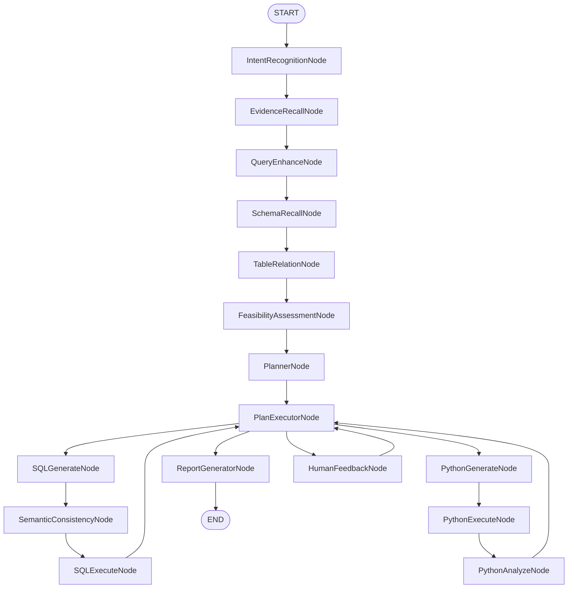

# 03.3 - Graph 节点方法级分析

> **模块状态**: ✅ 已完成  
> **上级目录**: [← 返回核心模块总览](./README.md)

---

## 🧭 总体流程图（节点级串联）

---

## 1) IntentRecognitionNode 方法解析

**源码**：[data-agent-management/src/main/java/com/alibaba/cloud/ai/dataagent/workflow/node/IntentRecognitionNode.java](data-agent-management/src/main/java/com/alibaba/cloud/ai/dataagent/workflow/node/IntentRecognitionNode.java)

### `apply()`
- **输入/输出**：读取 `INPUT_KEY`、`MULTI_TURN_CONTEXT`，输出 `INTENT_RECOGNITION_NODE_OUTPUT`。
- **黑盒逻辑**：构造意图识别提示词 → LLM 输出 JSON → 解析为意图 DTO。
- **关键规则**：输出以流式形式返回，便于前端逐步展示。
- **异常机制**：解析失败会导致下游分支判断不准。
- **二次开发指南**：扩展意图类型时需同步更新 DTO 与 Dispatcher 逻辑。

---

## 2) EvidenceRecallNode 方法解析

**源码**：[data-agent-management/src/main/java/com/alibaba/cloud/ai/dataagent/workflow/node/EvidenceRecallNode.java](data-agent-management/src/main/java/com/alibaba/cloud/ai/dataagent/workflow/node/EvidenceRecallNode.java)

### `apply()`
- **输入/输出**：读取 `INPUT_KEY`、`AGENT_ID`，输出 `EVIDENCE`。
- **黑盒逻辑**：先进行查询重写，再检索向量证据并拼装为提示词上下文。
- **关键规则**：`agentId` 为空直接断言失败，强制依赖上下文。

### `getEvidences()`
- **黑盒逻辑**：提取重写结果 → 检索知识 → 拼接证据文本。
- **异常机制**：发生异常时返回空证据并结束流。

### `outputRewrittenQuery()`
- **目的**：把“重写后的问题”推送给前端作为可解释中间结果。

### `retrieveDocuments()`
- **目的**：并行检索业务术语与智能体知识，并做统一封装。

### `buildFormattedEvidenceContent()`
- **目的**：把结构化文档拼接成 LLM 可用的证据块。

### `buildBusinessKnowledgeContent()` / `buildAgentKnowledgeContent()`
- **目的**：区分业务术语与智能体知识，输出不同格式。

### `processFaqOrQaKnowledge()`
- **目的**：为 QA/FAQ 提供“问答式证据”格式，增强可读性。

---

## 3) QueryEnhanceNode 方法解析

**源码**：[data-agent-management/src/main/java/com/alibaba/cloud/ai/dataagent/workflow/node/QueryEnhanceNode.java](data-agent-management/src/main/java/com/alibaba/cloud/ai/dataagent/workflow/node/QueryEnhanceNode.java)

### `apply()`
- **输入/输出**：读取 `INPUT_KEY`、`EVIDENCE`，输出 `QUERY_ENHANCE_NODE_OUTPUT`。
- **黑盒逻辑**：把用户问题重写成更明确的 canonical query。

### `handleQueryEnhance()`
- **黑盒逻辑**：从 LLM 输出中抽取 JSON → DTO。
- **异常机制**：解析失败返回空结果，后续召回效果降低。

---

## 4) SchemaRecallNode 方法解析

**源码**：[data-agent-management/src/main/java/com/alibaba/cloud/ai/dataagent/workflow/node/SchemaRecallNode.java](data-agent-management/src/main/java/com/alibaba/cloud/ai/dataagent/workflow/node/SchemaRecallNode.java)

### `apply()`
- **输入/输出**：读取 `QUERY_ENHANCE_NODE_OUTPUT`、`AGENT_ID`，输出表/字段文档。
- **黑盒逻辑**：先召回表文档，再基于表名召回字段文档。

### `extractTableName()`
- **目的**：从文档元信息中抽取表名集合。

---

## 5) TableRelationNode 方法解析

**源码**：[data-agent-management/src/main/java/com/alibaba/cloud/ai/dataagent/workflow/node/TableRelationNode.java](data-agent-management/src/main/java/com/alibaba/cloud/ai/dataagent/workflow/node/TableRelationNode.java)

### `apply()`
- **输入/输出**：读取召回文档、`AGENT_ID`，输出 `SchemaDTO` 与语义模型 Prompt。
- **黑盒逻辑**：合并逻辑外键 → 构建初始 schema → LLM 选择最优 schema。

### `buildInitialSchema()`
- **目的**：把表/字段文档与逻辑外键合并为初始 Schema。

### `processSchemaSelection()`
- **目的**：依据输入与证据执行“精细表选择”。

### `getLogicalForeignKeys()`
- **目的**：从逻辑外键表过滤出“与召回表相关”的关联。

---

## 6) FeasibilityAssessmentNode 方法解析

**源码**：[data-agent-management/src/main/java/com/alibaba/cloud/ai/dataagent/workflow/node/FeasibilityAssessmentNode.java](data-agent-management/src/main/java/com/alibaba/cloud/ai/dataagent/workflow/node/FeasibilityAssessmentNode.java)

### `apply()`
- **输入/输出**：读取 `SchemaDTO`、`EVIDENCE`，输出可行性判断结果。
- **黑盒逻辑**：判断是否“可执行/需澄清/可闲聊”。

---

## 7) PlannerNode 方法解析

**源码**：[data-agent-management/src/main/java/com/alibaba/cloud/ai/dataagent/workflow/node/PlannerNode.java](data-agent-management/src/main/java/com/alibaba/cloud/ai/dataagent/workflow/node/PlannerNode.java)

### `apply()`
- **输入/输出**：读取 `GENEGRATED_SEMANTIC_MODEL_PROMPT`、`SchemaDTO`，输出 `PLANNER_NODE_OUTPUT`。
- **黑盒逻辑**：生成计划 JSON，或在 `nl2sqlOnly` 下返回固定计划。

### `handlePlanGenerate()`
- **目的**：构建规划提示词并调用 LLM 输出计划。

### `handleNl2SqlOnly()`
- **目的**：直接返回“仅 SQL”固定计划。

### `buildUserPrompt()` / `formatValidationError()`
- **目的**：在计划修复时注入用户反馈。

---

## 8) PlanExecutorNode 方法解析

**源码**：[data-agent-management/src/main/java/com/alibaba/cloud/ai/dataagent/workflow/node/PlanExecutorNode.java](data-agent-management/src/main/java/com/alibaba/cloud/ai/dataagent/workflow/node/PlanExecutorNode.java)

### `apply()`
- **输入/输出**：读取 `PLANNER_NODE_OUTPUT`，输出 `PLAN_NEXT_NODE`。
- **黑盒逻辑**：验证计划结构与参数，决定下一步执行节点。

### `determineNextNode()`
- **目的**：根据 `toolToUse` 路由到 SQL/Python/Report。

### `validateExecutionPlanStructure()` / `validateExecutionStep()`
- **目的**：确保计划可执行，避免“空计划”或“缺参数”。

### `buildValidationResult()`
- **目的**：失败时递增修复次数并生成错误信息。

---

## 9) SqlGenerateNode 方法解析

**源码**：[data-agent-management/src/main/java/com/alibaba/cloud/ai/dataagent/workflow/node/SqlGenerateNode.java](data-agent-management/src/main/java/com/alibaba/cloud/ai/dataagent/workflow/node/SqlGenerateNode.java)

### `apply()`
- **输入/输出**：读取 `SQL_REGENERATE_REASON`、`SchemaDTO`，输出 `SQL_GENERATE_OUTPUT`。
- **黑盒逻辑**：支持多轮重试与失败分支控制。

### `handleRetryGenerateSql()` / `handleGenerateSql()`
- **目的**：把错误上下文、schema 与语义信息注入 SQL 生成。

---

## 10) SemanticConsistencyNode 方法解析

**源码**：[data-agent-management/src/main/java/com/alibaba/cloud/ai/dataagent/workflow/node/SemanticConsistencyNode.java](data-agent-management/src/main/java/com/alibaba/cloud/ai/dataagent/workflow/node/SemanticConsistencyNode.java)

### `apply()`
- **输入/输出**：读取 `SQL_GENERATE_OUTPUT`、`SchemaDTO`，输出一致性校验结果。
- **黑盒逻辑**：不通过即回写 `SQL_REGENERATE_REASON` 触发重试。

### `buildValidationResult()`
- **目的**：封装一致性校验的状态输出。

---

## 11) SqlExecuteNode 方法解析

**源码**：[data-agent-management/src/main/java/com/alibaba/cloud/ai/dataagent/workflow/node/SqlExecuteNode.java](data-agent-management/src/main/java/com/alibaba/cloud/ai/dataagent/workflow/node/SqlExecuteNode.java)

### `apply()`
- **输入/输出**：读取 `SQL_GENERATE_OUTPUT`，输出 `SQL_EXECUTE_NODE_OUTPUT`。
- **黑盒逻辑**：执行 SQL 并缓存结果用于 Python 分析。

### `executeSqlQuery()`
- **目的**：实际执行 SQL、处理异常并写入步骤结果。

### `enrichResultSetWithChartConfig()`
- **目的**：调用 LLM 生成可视化配置以增强前端展示。

---

## 12) PythonGenerateNode 方法解析

**源码**：[data-agent-management/src/main/java/com/alibaba/cloud/ai/dataagent/workflow/node/PythonGenerateNode.java](data-agent-management/src/main/java/com/alibaba/cloud/ai/dataagent/workflow/node/PythonGenerateNode.java)

### `apply()`
- **输入/输出**：读取 SQL 结果样本与 Schema，输出 `PYTHON_GENERATE_NODE_OUTPUT`。
- **黑盒逻辑**：将 SQL 结果映射为 Python 分析脚本。

---

## 13) PythonExecuteNode 方法解析

**源码**：[data-agent-management/src/main/java/com/alibaba/cloud/ai/dataagent/workflow/node/PythonExecuteNode.java](data-agent-management/src/main/java/com/alibaba/cloud/ai/dataagent/workflow/node/PythonExecuteNode.java)

### `apply()`
- **输入/输出**：读取 Python 脚本，输出 `PYTHON_EXECUTE_NODE_OUTPUT`。
- **黑盒逻辑**：执行失败达到阈值后进入降级模式。

---

## 14) PythonAnalyzeNode 方法解析

**源码**：[data-agent-management/src/main/java/com/alibaba/cloud/ai/dataagent/workflow/node/PythonAnalyzeNode.java](data-agent-management/src/main/java/com/alibaba/cloud/ai/dataagent/workflow/node/PythonAnalyzeNode.java)

### `apply()`
- **输入/输出**：读取 Python 输出，回写为步骤结果。
- **黑盒逻辑**：正常分析走 LLM，降级模式走固定提示。

---

## 15) ReportGeneratorNode 方法解析

**源码**：[data-agent-management/src/main/java/com/alibaba/cloud/ai/dataagent/workflow/node/ReportGeneratorNode.java](data-agent-management/src/main/java/com/alibaba/cloud/ai/dataagent/workflow/node/ReportGeneratorNode.java)

### `apply()`
- **输入/输出**：读取执行计划与结果，输出 `RESULT`。
- **黑盒逻辑**：根据模板生成 HTML/Markdown 报告。

### `getCurrentExecutionStep()`
- **目的**：定位当前步骤并确保索引合法。

### `generateReport()`
- **目的**：组合 Prompt 与模板，生成最终报告内容。

### `buildUserRequirementsAndPlan()` / `buildAnalysisStepsAndData()`
- **目的**：把计划与执行结果转成可读报告结构。

---

## 16) HumanFeedbackNode 方法解析

**源码**：[data-agent-management/src/main/java/com/alibaba/cloud/ai/dataagent/workflow/node/HumanFeedbackNode.java](data-agent-management/src/main/java/com/alibaba/cloud/ai/dataagent/workflow/node/HumanFeedbackNode.java)

### `apply()`
- **输入/输出**：读取 `HUMAN_FEEDBACK_DATA`，输出 `human_next_node`。
- **黑盒逻辑**：批准则继续，拒绝则回退并增加修复次数。

---

## 🧩 二次开发指南

1. 新增节点需同步更新：Graph 配置、Dispatcher、Plan 校验、前端渲染。
2. 新增方法级特性时，应先扩展状态键，再扩展 Prompt 或输出格式。
3. 若引入新 LLM 能力，优先在节点内部保持“业务逻辑先执行”的模式。
