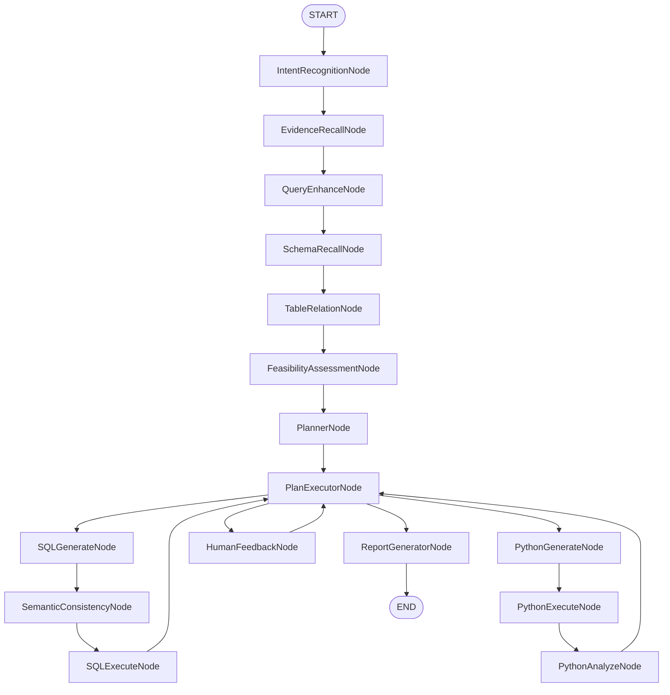
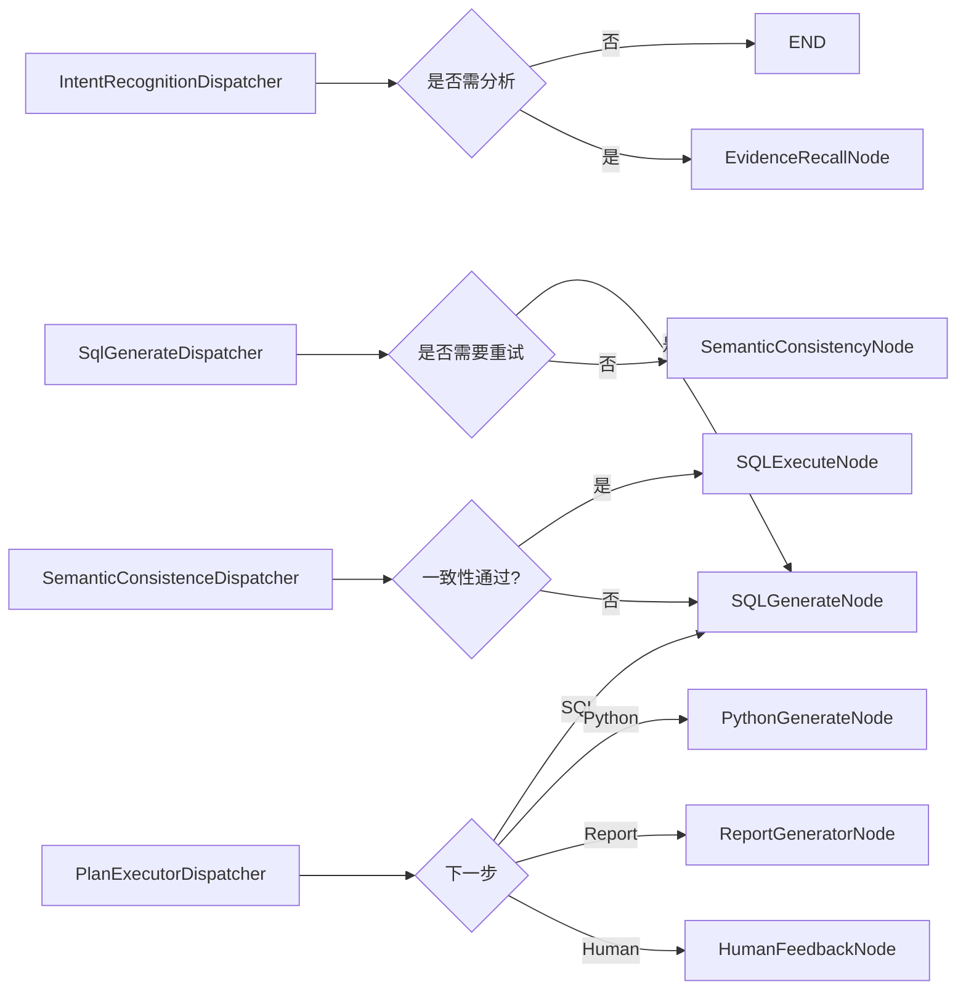

# 04 - StateGraph 工作流引擎

> **模块状态**: ✅ 已完成  
> **上级目录**: [← 返回索引](../00-index.md)

---

## 🔗 工作流节点 (Node)

系统定义了 16 个工作流节点：

| 节点 | 文件 | 阶段 | 职责 |
|------|------|------|------|
| `IntentRecognitionNode` | 3.4KB | 意图理解 | 识别用户查询意图 |
| `QueryEnhanceNode` | 3.9KB | 意图理解 | 查询语句增强 |
| `SchemaRecallNode` | 4.8KB | Schema 检索 | 召回相关表结构 |
| `EvidenceRecallNode` | 14.6KB | Schema 检索 | 召回业务证据与知识 |
| `TableRelationNode` | 11.2KB | Schema 检索 | 推理表之间的关联关系 |
| `SqlGenerateNode` | 7.1KB | SQL 阶段 | 生成 SQL 语句 |
| `SqlExecuteNode` | 12.8KB | SQL 阶段 | 执行 SQL 并处理结果 |
| `SemanticConsistencyNode` | 4.4KB | SQL 阶段 | 校验语义一致性 |
| `FeasibilityAssessmentNode` | 3.2KB | 计划阶段 | 评估任务可行性 |
| `PlannerNode` | 5.2KB | 计划阶段 | 生成执行计划 |
| `PlanExecutorNode` | 7.0KB | 计划阶段 | 执行计划步骤 |
| `HumanFeedbackNode` | 3.0KB | 计划阶段 | 接收人工反馈 |
| `PythonGenerateNode` | 5.6KB | Python 阶段 | 生成 Python 代码 |
| `PythonExecuteNode` | 7.0KB | Python 阶段 | 执行 Python 代码 |
| `PythonAnalyzeNode` | 4.2KB | Python 阶段 | 分析执行结果 |
| `ReportGeneratorNode` | 10.1KB | 报告阶段 | 生成最终报告 |

---

## 🚦 调度器 (Dispatcher)

| 调度器 | 职责 |
|--------|------|
| `IntentRecognitionDispatcher` | 意图识别路由 |
| `QueryEnhanceDispatcher` | 查询增强路由 |
| `SchemaRecallDispatcher` | Schema 召回路由 |
| `TableRelationDispatcher` | 表关系路由 |
| `SqlGenerateDispatcher` | SQL 生成路由 |
| `SQLExecutorDispatcher` | SQL 执行路由 |
| `SemanticConsistenceDispatcher` | 语义一致性路由 |
| `FeasibilityAssessmentDispatcher` | 可行性评估路由 |
| `PlanExecutorDispatcher` | 计划执行路由 |
| `HumanFeedbackDispatcher` | 人工反馈路由 |
| `PythonExecutorDispatcher` | Python 执行路由 |

---

## 📊 工作流图（全链路）

---

## 🧠 核心运行机制

### 1) StateGraph 的“状态键策略”

StateGraph 通过 **KeyStrategy** 决定每个状态键的合并/覆盖方式。系统将所有核心键设置为 `REPLACE`，确保每个节点输出都会**覆盖旧状态**，避免上下文污染。

**关键状态键示例**：
- `INPUT_KEY`：用户问题
- `AGENT_ID`：智能体上下文
- `EVIDENCE`：证据检索结果
- `TABLE_RELATION_OUTPUT`：最终 SchemaDTO
- `SQL_GENERATE_OUTPUT`：SQL 生成结果
- `SQL_EXECUTE_NODE_OUTPUT`：执行结果集
- `RESULT`：最终报告输出

**业务意义**：
- 避免长链路堆积状态导致“旧结果干扰新决策”。

---

### 2) Graph 编译与中断点

图在启动时编译，并设置 **HumanFeedbackNode** 为中断点：
- 当需要人工复核时，Graph 会暂停并等待外部输入。
- 反馈接收后通过 `updateState()` 恢复执行。

**业务意义**：
- 适合高风险业务场景，避免误答或误操作。

---

### 3) 多轮对话上下文管理

Graph 执行过程中会维护多轮上下文：
- `beginTurn()`：记录本轮输入
- `appendPlannerChunk()`：将 Planner 输出纳入上下文
- `finishTurn()`：完成本轮

**业务意义**：
- 支持“连续追问”，避免前后断层。

---

### 4) 流式输出机制（SSE）

Graph 节点通过 `StreamingOutput` 输出内容，服务层将其包装为 SSE：
- 前端可实时渲染思考与结果
- 失败时返回 `STREAM_EVENT_ERROR`
- 完成时返回 `STREAM_EVENT_COMPLETE`

**业务意义**：
- 提升交互体验，并减少用户等待焦虑。

---

## 🧩 关键路由规则（Dispatcher）

调度器负责节点间分支选择，形成**可中断、可回退**的执行路径：

---

## 🔄 人工反馈闭环

当 `HUMAN_REVIEW_ENABLED` 为 true 时：
1. 计划生成完成后跳转到 `HumanFeedbackNode`
2. 用户拒绝 → 回到 `PlannerNode` 重建计划
3. 用户通过 → 继续执行 `PlanExecutorNode`

**业务意义**：
- 形成“人机协同”的治理闭环，适合高风险场景。

---

## ⚠️ 异常处理与稳定性策略

| 风险点 | 处理策略 | 业务含义 |
|--------|----------|----------|
| SQL 生成失败 | 重试计数 + 语义修复 | 保证 SQL 可执行性 |
| SQL 执行失败 | 触发 SQL 重写 | 避免错误结果返回 |
| Python 执行失败 | 降级策略 | 保障流程不中断 |
| 人工反馈超限 | 强制终止 | 防止无限循环 |

---

## 🧭 二次开发指南

1. **新增节点**：必须在 StateGraph 中注册，并在 Dispatcher 中增加路由分支。
2. **新增状态键**：需在 KeyStrategy 中声明合并策略，否则会导致状态不可用。
3. **改变计划结构**：必须同步更新 `PlanExecutorNode` 的校验逻辑。
4. **多模型扩展**：建议在节点内部保持“业务逻辑先执行、展示流后输出”的模式。

